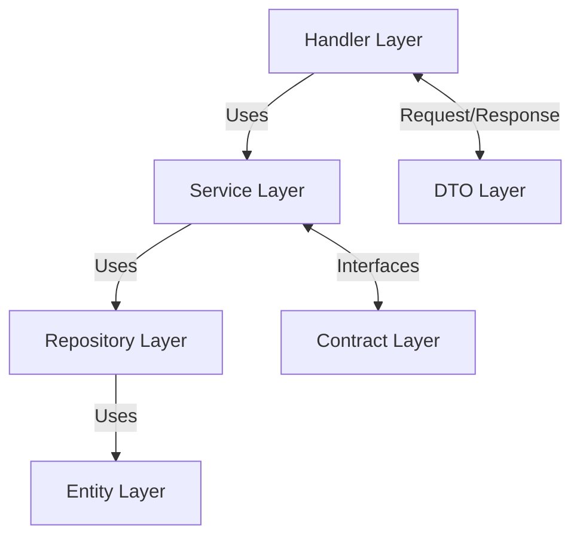
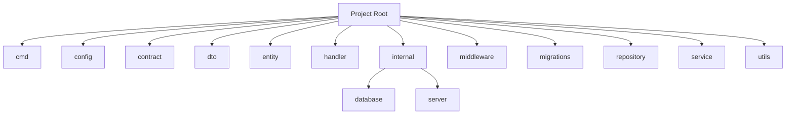

# Golang Tutorial Project

A Go-based REST API implementing a 6-layer architecture pattern using the Gin framework and PostgreSQL database.

## Architecture Overview

This project implements a 6-layer architecture for clean and maintainable code:



### Layer Descriptions

1. **Handler Layer** (`/handler`)
   - Manages HTTP requests and responses
   - Implements REST API endpoints
   - Routes requests to appropriate services

2. **Service Layer** (`/service`)
   - Contains business logic
   - Orchestrates data flow between handlers and repositories
   - Implements business rules and validations

3. **Repository Layer** (`/repository`)
   - Handles database operations
   - Implements data access patterns
   - Manages entity persistence

4. **Entity Layer** (`/entity`)
   - Defines database models
   - Represents data structures

5. **DTO Layer** (`/dto`)
   - Defines Data Transfer Objects
   - Handles request/response structures
   - Manages data transformation

6. **Contract Layer** (`/contract`)
   - Defines interfaces
   - Establishes boundaries between layers
   - Enables dependency injection

## Project Structure



## Prerequisites

- Go 1.x
- PostgreSQL
- [Air](https://github.com/cosmtrek/air) (for live reload)

## Configuration

Create a `.env` file in the root directory with the following variables:

```env
PORT=8080
IS_PRODUCTION=false

DB_USER=your_db_user
DB_PASS=your_db_password
DB_NAME=your_db_name
DB_HOST=localhost
DB_PORT=5432
DB_SSL_MODE=false
DB_TIME_ZONE=UTC
```

## Setup & Installation

1. Install dependencies:
   ```bash
   go mod tidy
   ```

2. Install Air for live reload:
   ```bash
   go install github.com/air-verse/air@latest
   ```

3. Set up the database:
   - Create a PostgreSQL database
   - Configure the `.env` file with your database credentials
   - Run migrations (migrations are automatically executed on startup)

## Running the Application

1. Start the development server with live reload:
   ```bash
   air
   ```

2. The server will start at `http://localhost:8080` (or the configured PORT)

## API Endpoints

### Intro Endpoints

1. Get Intro by ID
   ```
   GET /intro/:id
   ```
   Response:
   ```json
   {
     "id": 1,
     "nama": "string",
     "nama_panggilan": "string",
     "fun_fact": "string",
     "keinginan_BE": "string"
   }
   ```

2. Create New Intro
   ```
   POST /intro/create
   ```
   Request Body:
   ```json
   {
     "nama": "string",
     "nama_panggilan": "string",
     "fun_fact": "string",
     "keinginan_BE": "string"
   }
   ```

## Database Schema

### Intro Table
```sql
CREATE TABLE intro (
    id SERIAL PRIMARY KEY,
    nama VARCHAR(255) NOT NULL,
    nama_panggilan VARCHAR(255),
    fun_fact VARCHAR(255),
    keinginan_BE VARCHAR(255),
    updated_at TIMESTAMP NOT NULL DEFAULT NOW(),
    created_at TIMESTAMP NOT NULL DEFAULT NOW()
)
```
